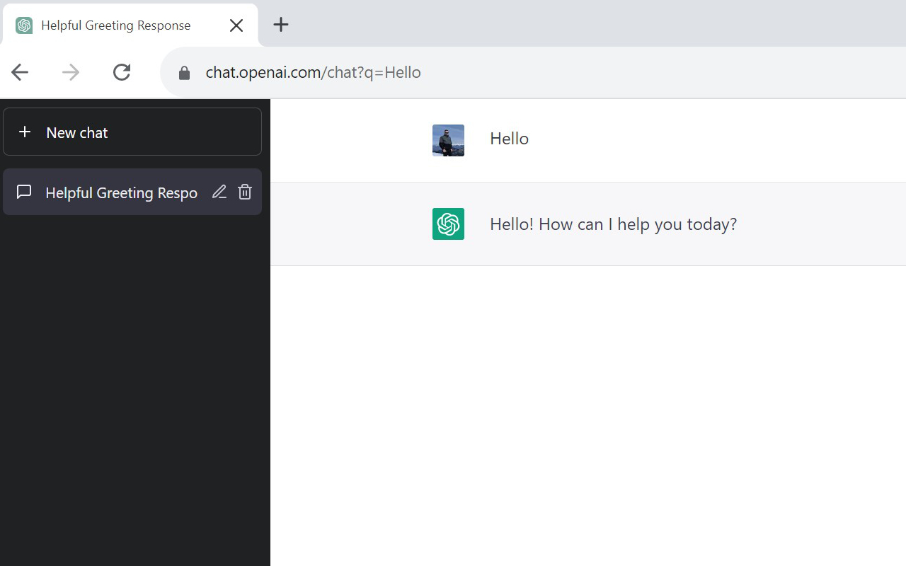

# ChatGPT Shortcut

The extension adds the ability to query ChatGPT by OpenAI outside of the ChatGPT website automatically via permalinks with the GET parameter named 'q'. This is especially useful when you use launcher apps like Spotlight, Alfred, LaunchBar, Flow Launcher, Wox ...

Structure of query: `https://chat.openai.com/chat?q={query}`

## Usage

## Permalink

